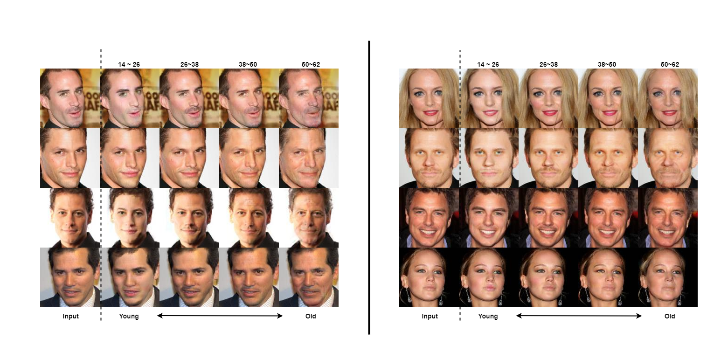
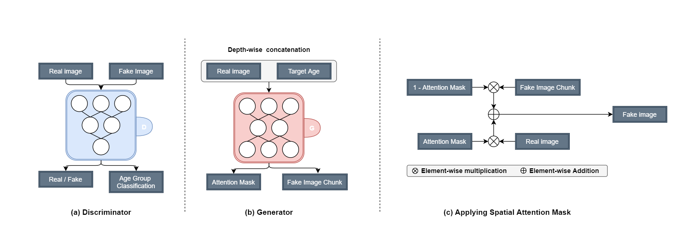
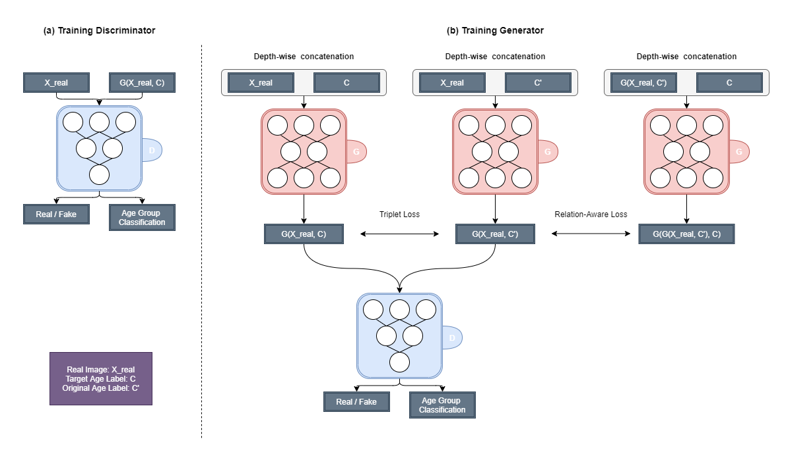
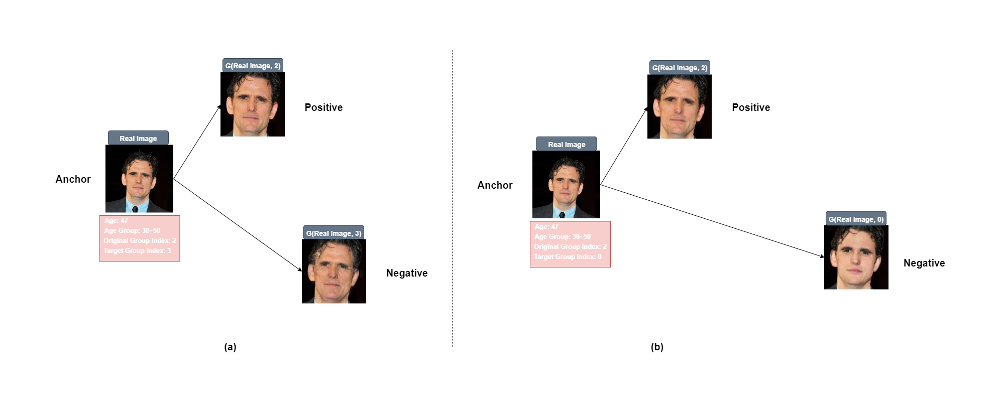
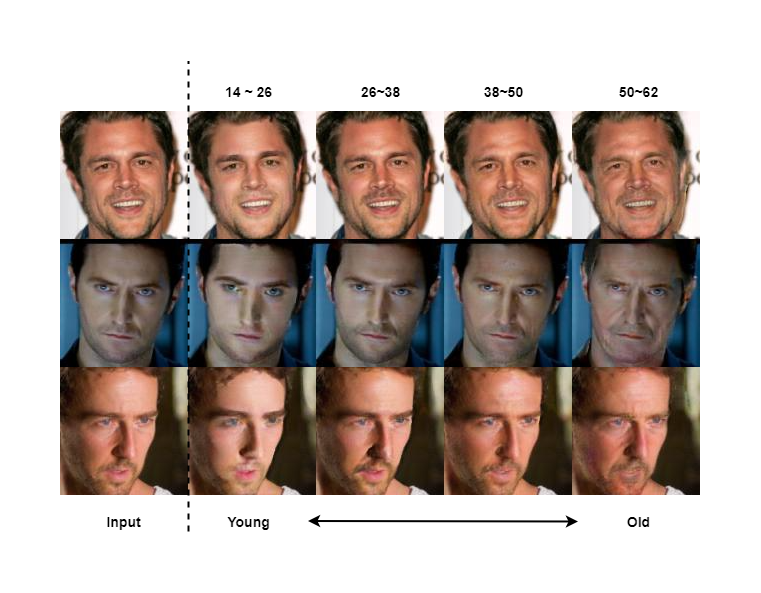
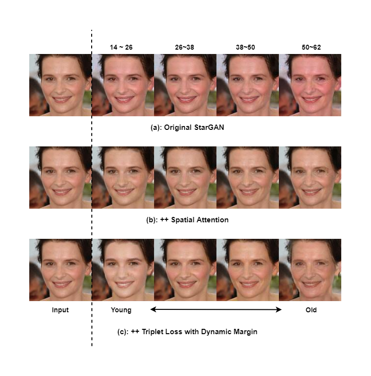
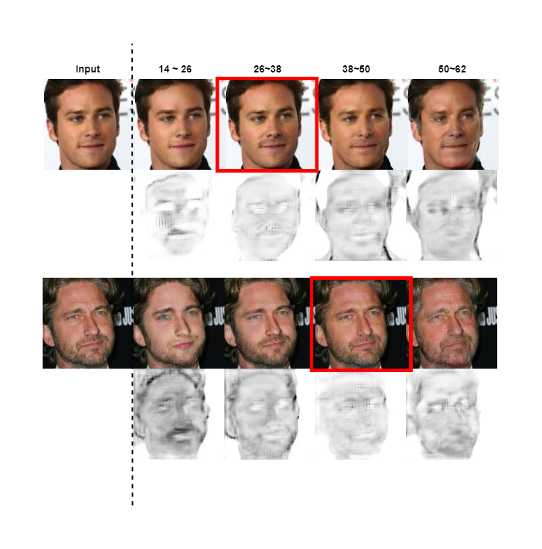
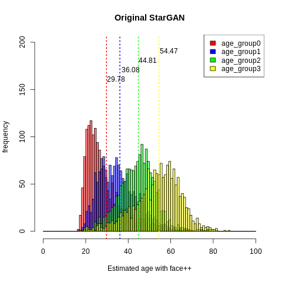
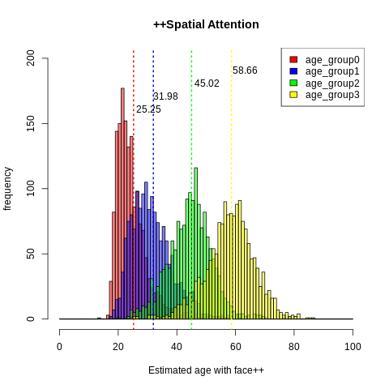
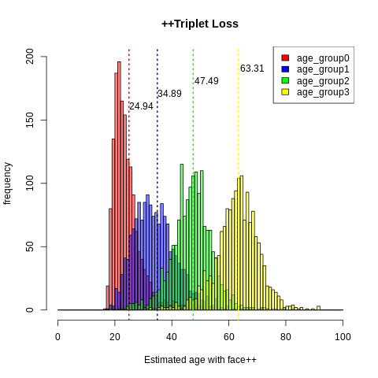

## Aging-StarGAN


<p align="center"></p>

This repository provides the PyTorch implementation of Aging-StarGAN which is a novel framework for face-aging task.
> **Aging-StarGAN: Age Translation Between Age Groups with Unified Generative Adversarial Network**<br>
> [Hankyu Jang](https://github.com/hanq0212)<br/>
> <sup></sup>DEAL LAB, KAIST  <br/>
> Paper: https://drive.google.com/file/d/13rt_fMW80rMKNGTpU2uNdkfEe0t_XbcZ/view?usp=sharing <br>
>
> **Abstract:** *Recent studies of face aging require two or more generators
to translate to multiple ages, or otherwise, there is
a limitation that cannot generate age patterns except wrinkle.
To address this limitation, we propose Aging-StarGAN,
which is a novel framework that can perform age group
translation among multiple age groups with only a single
generator. Also, It uses spatial attention mechanism
and triplet loss with dynamic margin to achieve identity
presevation, ghosting artifacts removal and to capture aging
pattern more than wrinkles. We perfomed experiments
that demonstrate the efficiency and superiority of Aging-
StarGAN.*

## Dependencies
* To download the required dependencies:
```bash
conda create -n face_aging python=3.6
activate face_aging
pip install -r requirements.txt
```


## Downloading datasets
To download the CACD dataset, visit [here](https://bcsiriuschen.github.io/CARC/).

To download the UTKFace dataset, visit[here](https://susanqq.github.io/UTKFace/).

## Training networks
To train Aging-StarGAN, run the training script below. 

```bash
# Train Aging-StarGAN using the CelebA dataset
python main.py --mode train --dataset CACD --image_size 128 --c_dim 4 \
               --sample_dir aging_stargan/samples --log_dir aging_stargan/logs \
               --model_save_dir aging_stargan/models --result_dir aging_stargan/results \
               --age_group 4 --age_group_mode 2 --attention True --additional_dataset True

# Test Aging-StarGAN using the CelebA dataset
python main.py --mode train --dataset CACD --image_size 128 --c_dim 4 \
               --sample_dir aging_stargan/samples --log_dir aging_stargan/logs \
               --model_save_dir aging_stargan/models --result_dir aging_stargan/results \
               --age_group 4 --age_group_mode 2 --attention True --additional_dataset True \
               --test_version 1

```

## Using pre-trained networks
To download a pre-trained model checkpoint, visit [here](https://drive.google.com/drive/folders/1741dBazhcRZh7vaPuyI_BTjl9NoLMMZE?usp=sharing). After download the pre-trained model checkpoint  and save it into your model_save_dir

To translate images using the pre-trained model, run the evaluation script below. The translated images will be saved into result_dir

```bash
$ python main.py --mode train --dataset CACD --image_size 128 --c_dim 4 \
                 --sample_dir aging_stargan/samples --log_dir aging_stargan/logs \
                 --model_save_dir aging_stargan/models --result_dir aging_stargan/results \
                 --age_group 4 --age_group_mode 2 --attention True --additional_dataset True \
                 --test_version 1
```

## Addtional Results (Figures)

Network
<p align="center"></p>
<p align="center"></p>

Triplet Loss with dynamic margin
<p align="center"></p>
<p align="center"></p>


Qualitative Evaluation - (1) Results
<p align="center"></p>

Qualitative Evaluation - (2) Ablation Study
<p align="center"></p>

Qualitative Evaluation - (2) Mask Activation
<p align="center"></p>

Quantitative Evaluation - Age Seperation
<p align="left"></p>
<p align="center"></p>
<p align="right"></p>
